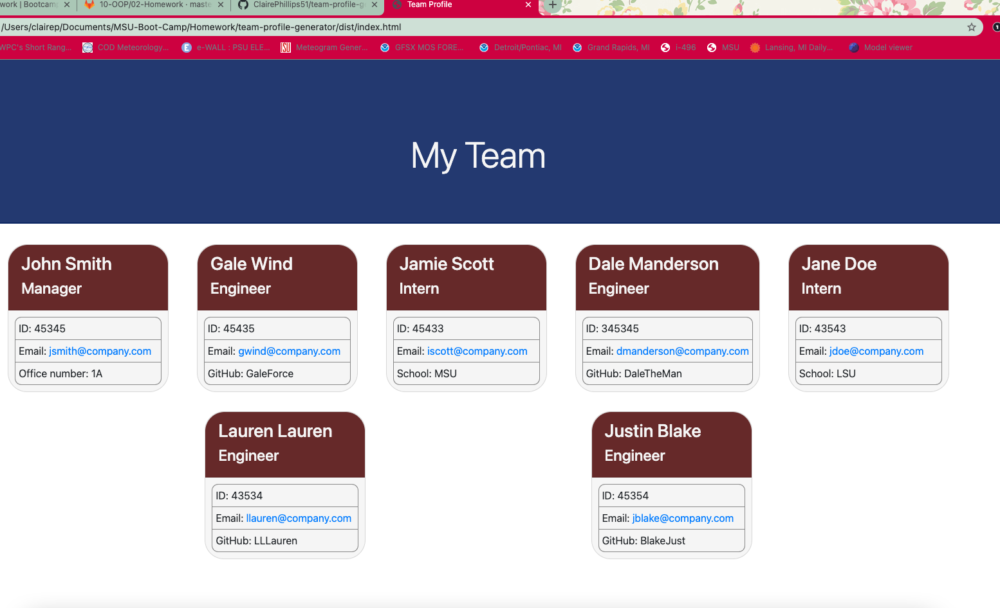
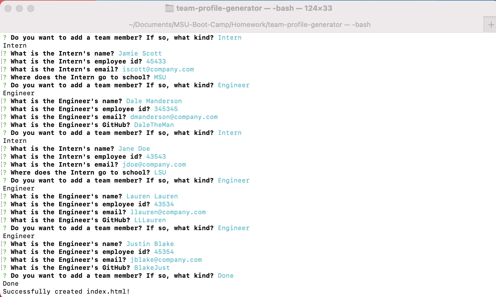
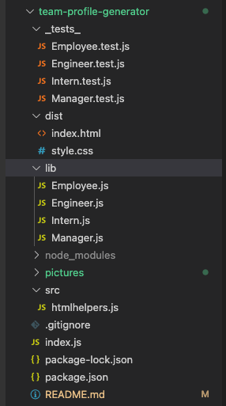
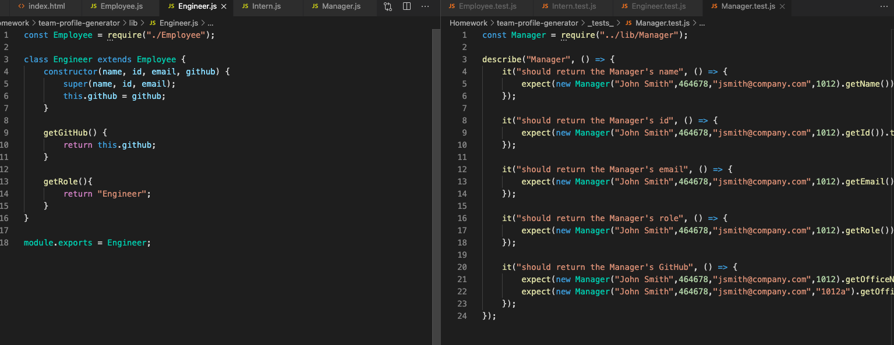
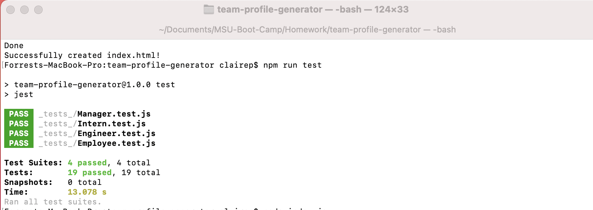

# team-profile-generator

## Links
Link to viedo: [Team Profile Generator Video](https://drive.google.com/file/d/1HAFPCAg5VGkYCV6_47GeTcE4k6KYDusZ/view)

Link to sample Team Profile page created using the application: [Sample HTML file using application](https://drive.google.com/drive/u/0/folders/1qkthaH_gqMywal1tLxAeHHcpmrNr8vBQ)

What the generated HTML will look like. 

## Summary
Using node.js in the command line to generate a working html document contaning team profiles. Using jest to test the class applications from the command line.  A walkthrough video of how the application works and a sample readme generatred using the application can be found in the links above. 

## Table of Contents
1. [Usage](#usage)
2. [Set Up](#set-up)
3. [Tests](#tests)
4. [Resources](#resources)

## Usage
The team profile generator is launched using node.js in the terminal. There the user type in "node index.js" which will trigger the inquirer prompts. The first set of prompts are questions that will ask for the manager's information. The empolyee's name, id, email, and office number are asked for. Those questions are generated using the inquirer prompts.

Once the user answers all the questions related to the manager a list appers asking if you want to add another employee with: Engineer, Intern, or done as the options. If Engineer is selected then prompts asking the engineer's name, id, email, and GitHub user name are shown. If an Intern is selected then the prompts asking for the intern's name, id, email, and school are shown. If done is selcted then the application ends and the HTML file is written.

## Set Up
This application is run using the inquirer package, the test are ran using jest so both have be installed. In the terminal type in "npm init -y" then "npm intall inquirer" to load the package to your local folder. The same process is used to install jest. A gitignore file was also created to store the .DS_Store folder and node_modules directory so that wouldn't be tracked or uploaded to GitHub. 

A multi-file sttructure was used to seperate the different pieces of this applicaton. A _tests_ folder holds the indvidual test.js files for the different employee types that is connected to the corrisponding class javascript files. The dist folder holds the generated index file and css stylesheet. The lib folder holds all the different classes. A source (src) file holds the htmlhelper javascript file that creates the various functions that generates the structure for the index.html file once it's made.  An index.js file is also needed to write the code that will create the inquirer prompts and pull the answers from the classes and then plot them in the html using the htmlhelpers file. 

## Tests
Jest was installed so the test are run using the terminal. There are 4 test files corrisponding to the four class files.  Employee is the base class then Manager, Engineer, and Intern branch off from that. 

"npm run test" is typed in the terminal to see if the tests pass or fail. The test are used to see if the functions created in the class js files work or fail. Each file runs five functions that look for the employess name, role, id, email, and then one extra paramater that is dependant on the type of employee. 
If the test pass you will get a PASS next to the file name in the terminal.

## Resources
* [Async Functions](https://developer.mozilla.org/en-US/docs/Web/JavaScript/Reference/Statements/async_function)
* [npm Inquirer](https://www.npmjs.com/package/inquirer)
* [npm-Jest](https://jestjs.io/docs/getting-started) 